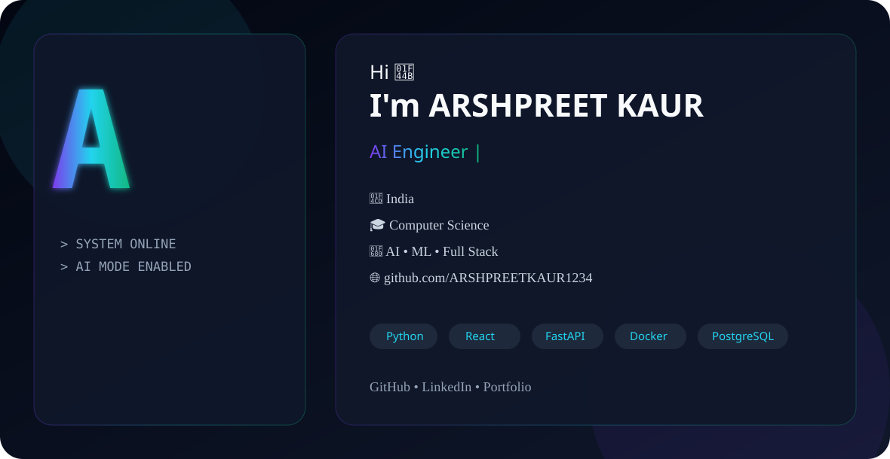

<div align="center">

#  Hi, I'm ARSHPREET KAUR

### AI Engineer • Machine Learning Enthusiast • Full Stack Developer • Open Source Contributor

<picture>
    <source media="(prefers-color-scheme: dark)" srcset="./assets/dark.svg">
    <source media="(prefers-color-scheme: light)" srcset="./assets/light.svg">
    
</picture>

<br>

<p align="center">


</p>

</div>

---

# 👩‍💻 About Me

```yaml
Name: ARSHPREET KAUR

Location: India 🇮🇳

Current Focus:
  - Artificial Intelligence
  - Machine Learning
  - Full Stack Development
  - Generative AI
  - Open Source

Currently Learning:
  - LangChain
  - AI Agents
  - MLOps
  - System Design

Looking For:
  - Software Engineering Roles
  - AI Engineer Roles
  - Open Source Collaboration
```

---

# 🚀 Tech Stack

### Languages

<p>


</p>

---

### Frontend

<p>


</p>

---

### Backend

<p>


</p>

---

### AI / ML

- TensorFlow
- PyTorch
- LangChain
- OpenAI API
- Hugging Face
- Pandas
- NumPy
- Scikit-Learn

---

### Databases

<p>


</p>

---

### Cloud & DevOps

<p>


</p>

---

# 📊 GitHub Stats

<div align="center">


</div>

---

# 📈 Activity Graph

<div align="center">


</div>

---

# 🏆 GitHub Trophies

<div align="center">


</div>

---

# 💻 Most Used Languages

<div align="center">


</div>

---

# 📌 Featured Projects

| Project | Description |
|----------|-------------|
| 🤖 AI Applications | Intelligent AI-powered projects |
| 📊 Machine Learning | Predictive analytics and ML models |
| 🌐 Full Stack Apps | React + Node + FastAPI |
| ⚡ Open Source | Contributions and utilities |

---

# 📫 Connect With Me

<p align="center">

<a href="https://github.com/ARSHPREETKAUR1234">


</a>

<a href="#">


</a>

<a href="#">


</a>

</p>

---

<div align="center">

### ⭐ Thanks for visiting my profile!

*"Building AI solutions for tomorrow."*

</div>
